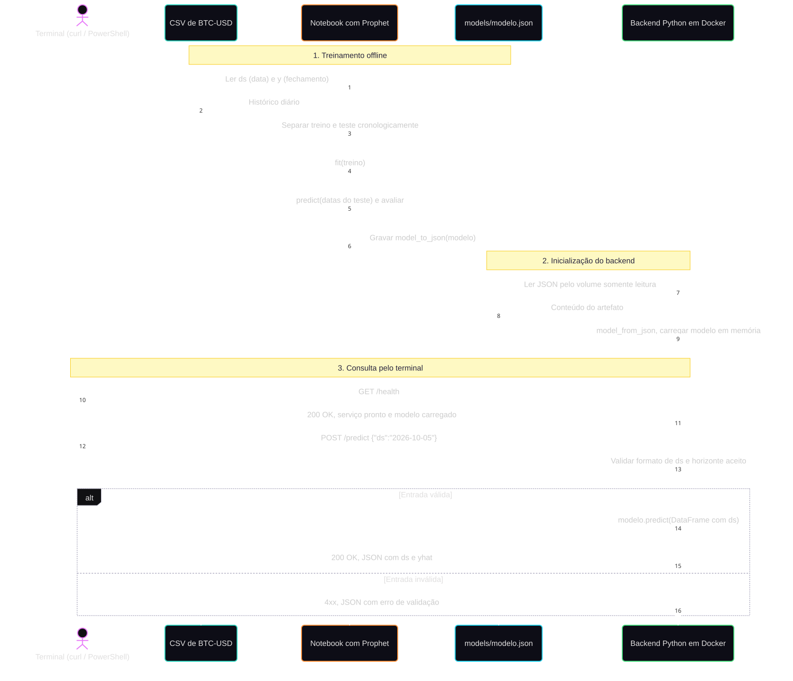
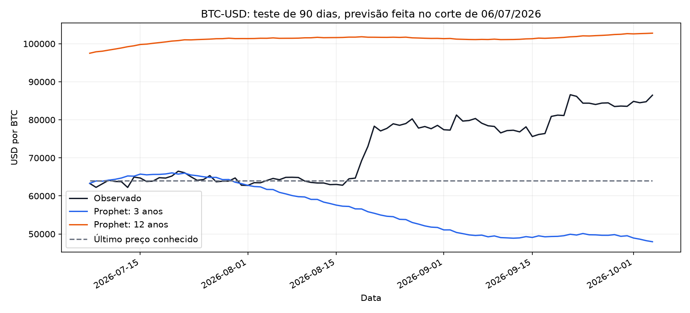

# Devlog

## 05/10/2026

### Registro original do autor

Anotações fornecidas pelo autor. A redação e a cronologia foram preservadas; a marcação Markdown foi normalizada e as figuras usam os arquivos correspondentes do repositório.

14:17 - Começo da ponderada: Leitura do material

14:23 - Dúvidas levantadas: Qual moeda escolher? Minha suposição é que bitcoin precisaria de um volume de dados muito grande, que meu ssd com 10gb livres não iriam suportar. Mas também suponho que para prever dollar preciariamos correlacionar muitas variáveis da politica internacional

14:25 - Esboço do diagrama UML

14:32 - Revisão do esboço com IA: GPT 6.1 Sol Ultra em Fast Mode

Figura 01: V0 (esboço) da arquitetura/fluxo feito no excalidraw


14:40 - Os pontos levantados foram justamente a falta de detalhamento entre as etapas, que o recebimento de dados seria feito por csv, se fariamos scripts ou notebooks, o que vai e o que não vai estar no container e etc. Solicitei uma versão revisada no mermaid e o resultado foi:

Figura 02: V1 da arquitetura, revisada e iterada com IA


14:47 - Instruí meu agente para utilizar a ferramente Prophet [Quick Start | Prophet](https://facebook.github.io/prophet/docs/quick_start.html) para produção de modelos

Figura 03: V1.1 da arquitetura, revisada e iterada com IA



14:49 - Utilizei o agente para tirar a dúvida sobre qual moeda escolher com base nos dados disponíveis no yahoo finance

15:03 - Acabou que com fechamentos diários o dataset de BTC previsto em USD pesou apenas 26,3Kb com 3 anos de dados (1.096 registros de 05/10/2023 a 04/10/2026). Então optei por utilizar o histórico completo no dataset, de 17/09/2014 a 04/10/2026. Dataset Utilizado: [Yahoo Finance: histórico BTC-USD](https://finance.yahoo.com/quote/BTC-USD/history/). Mais dados não significam um modelo melhor, o passado pode ter (e tem) um comportamento diferente do mercado atual, mas isso só veremos nos testes, o aumento de histórico deve ser avaliado.

Prévia do dataset df.head():

| Data | Valor |
| - | -: |
| 2023-10-05 | 27.415,91 |
| 2023-10-06 | 27.946,60 |
| 2023-10-07 | 27.968,84 |
| 2023-10-08 | 27.935,09 |
| 2023-10-09 | 27.583,68 |

15:09 - Senti falta de um diagrama de sequencia, então utilizei o que já temos como base para desenvolver um diagrama de sequencia

Figura 04: V1 do diagrama de sequencia da solução



Achei condizente com o que precisamos entregar, está horizontalmente grande, mas representa bem e com simplicidade todos os pontos solicitados na ponderada

15:13: A estrutura atual do repositório é

```text
Ponderada Comp/
├── README.md
├── DEVLOG.md
├── .gitignore
├── .gitattributes
├── backend/
│   └── README.md
├── client/
│   └── README.md
├── data/
│   ├── README.md
│   ├── download_btc.py
│   ├── coleta-btc-usd.json
│   └── processed/
│       └── btc_usd_daily.csv
├── docs/
│   ├── requisitos.md
│   ├── arquitetura.md
│   ├── arquitetura.mmd
│   ├── arquitetura.puml
│   ├── pipeline.mmd
│   ├── sequencia.mmd
│   └── imagens/
│       ├── esboco-pipeline-original.png
│       ├── arquitetura-mermaid.svg
│       ├── arquitetura-mermaid-editor.jpg
│       ├── pipeline-mermaid.svg
│       ├── pipeline-mermaid-editor.jpg
│       ├── sequencia-mermaid.svg
│       └── sequencia-mermaid-editor.jpg
├── models/
│   └── README.md
└── training/
    └── README.md
```

Ainda sem dockerfile e compone.yaml. Já temos muitos arquivos e pastas, meu ambiente de desenvolvimento acaba sendo muito verboso, tenho instruções para documentações completas, por isso pipeline, arquitetura, requisitos e readme’s localizados.

15:16 - Utilizando inicialmente MAE (Mean Absolute Error) como métrica, solicitei a produção de dois modelos, o primeiro com 3 anos de dados e um segundo com toda a série disponível no dataset, 12 anos.

15:20 - Enquanto os modelos estavam sendo treinados, avaliei outro agente para paralelizar a dockerização, mas não achei que valia a pena dividir contexto ainda

15:26 - Os primeiros resultados saíram, o modelo com 3 anos de dados produziu um erro muito menor no começo, mas no fim ambos terminaram péssimos.



15:29 - Pretendo testar também o modelo Arima, mas como preciso focar nos entregáveis, deixarei um agente cuidando disso e outro focando no que realmente importa para a entrega: O backend no container, o dockerfile e arquivo compose

Notas de conferência: a identificação da ferramenta é a informada pelo autor; o tamanho medido do CSV de três anos é 26.968 bytes (26,3 KiB). A prévia acima corresponde ao recorte de três anos e confere com o CSV; o histórico longo começa em 17/09/2014. A árvore é o retrato registrado às 15:13. As figuras 02 e 03 foram recuperadas das exportações históricas no Git, e não das referências `library-file` coladas na mensagem.

### Registros técnicos da execução com IA

As etapas abaixo mantêm o estado observado em cada checkpoint; os registros antigos de pendências não substituem o estado atual descrito no README.

### Preparação do repositório com IA

- Enunciado consultado no repositório indicado pelo autor.
- Estrutura inicial criada para dados, treinamento, modelos, backend e cliente.
- Moeda e implementação permanecem pendentes.
- O dado "10gb livres" acima foi preservado como percepção inicial. A inspeção do ambiente encontrou aproximadamente 2,84 GiB livres em C:, sinal que pode mudar com o uso do computador.
- Nenhum treinamento, container ou resultado de predição foi executado nesta preparação.

### Próxima etapa

Revisar a arquitetura de componentes e definir um recorte pequeno de dados antes de implementar o treinamento.

### Revisão proposta da arquitetura com IA

- O esboço original foi preservado como pipeline de construção do modelo. A [arquitetura de componentes proposta](docs/arquitetura.md), com [fonte UML](docs/arquitetura.puml), complementa esse registro.
- A proposta conecta CSV, ambiente de treinamento, artefato com modelo e transformações, volume `models/` somente leitura, backend Python em Docker e cliente HTTP. `GET /health` e `POST /predict` são interfaces propostas.
- O pipeline detalhado inclui divisão cronológica, validação para seleção e teste final reservado. Transformações que aprendem parâmetros serão ajustadas somente no treino.
- Moeda, fonte, horizonte, formato do artefato, modelo e implementação continuam abertos. Esta revisão não representa treinamento executado nem predição demonstrada.

### Nova versão em Mermaid, solicitada pelo autor

- O formato visual foi alterado para Mermaid após o pedido de edição no Excalidraw.
- Foram criados dois diagramas: arquitetura da solução e pipeline detalhado de ML. O esboço original permanece preservado.
- A revisão acrescenta exportação do artefato, montagem em volume somente leitura, backend, cliente e troca HTTP/JSON.
- No pipeline, a revisão explicita divisão cronológica, validação, teste final reservado e exportação das transformações.

### Simplificação solicitada pelo autor

- A interface de uso será o terminal, com `curl` ou `Invoke-RestMethod`.
- A proposta atual usa um CSV pequeno, um notebook, um modelo exportado e um container de backend Python.
- A divisão inicial será treino/teste cronológica. A comparação entre vários modelos e a validação adicional da proposta anterior ficam como extensões opcionais.
- A versão Mermaid foi ajustada a esse escopo. A revisão acima permanece como registro da evolução, e a [arquitetura atual](docs/arquitetura.md) descreve a proposta vigente.

### Validação da documentação

- Os dois diagramas Mermaid foram renderizados no Mermaid Live no navegador. Essa verificação confirma a sintaxe e a apresentação dos diagramas, não a execução da solução.
- Exportações SVG e capturas do editor foram preservadas em `docs/imagens/`.
- [Captura da arquitetura](docs/imagens/arquitetura-mermaid-editor.jpg) e [captura do pipeline](docs/imagens/pipeline-mermaid-editor.jpg).

### Recomendação do professor: Prophet

- O autor informou que o professor recomendou o [Quick Start do Prophet](https://facebook.github.io/prophet/docs/quick_start.html). A proposta foi ajustada para usar essa biblioteca com `ds` (data) e `y` (preço).
- O artefato proposto mudou de Joblib para `models/modelo.json`, usando `model_to_json` e `model_from_json`, conforme a [documentação de serialização](https://facebook.github.io/prophet/docs/additional_topics.html#saving-models).
- O backend receberá a data `ds` e devolverá a previsão `yhat`. O terminal continua sendo a interface de uso.
- A avaliação será feita apenas nas datas do teste reservado. O histórico incluído por padrão em `make_future_dataframe` não será tratado como resultado de teste.
- Este checkpoint atualiza a documentação. Prophet ainda não foi instalado nem executado. A proposta anterior e suas capturas permanecem recuperáveis no [commit 2911e61](https://github.com/C-Icaro/ponderada-m7-predicao-moeda/commit/2911e61b310f7d18bfef6a49634dde743b5c7a42).

### Busca e coleta de BTC-USD no Yahoo Finance

- O autor solicitou buscar um histórico adequado à limitação de espaço. Foi obtido um recorte diário de 05/10/2024 a 04/10/2026, com 730 registros. Uma observação diária evita o volume de negociações individuais que motivou a dúvida inicial.
- A página histórica retornou HTTP 429 na ferramenta de pesquisa; a consulta do endpoint de histórico do Yahoo pelo Python local respondeu normalmente. A coleta foi executada com `python data/download_btc.py`, usando apenas a biblioteca padrão, sem instalar pacotes.
- O CSV `data/processed/btc_usd_daily.csv` tem somente `ds` (data da fonte UTC) e `y` (fechamento em USD por BTC). Tamanho medido: 17.853 bytes, aproximadamente 17,4 KiB. A inspeção encontrou cerca de 2,81 GiB livres em C:.
- O Yahoo retornou uma observação adicional de 05/10/2026; ela foi removida pelo filtro de fim exclusivo. Foram conferidos intervalo completo, duplicatas, lacunas, valores finitos e positivos, tamanho e SHA-256. A leitura pelo pandas já disponível no ambiente também foi validada.
- [Procedência da coleta](data/coleta-btc-usd.json) e [instruções de obtenção](data/README.md) foram registradas. Os preços permanecem em arquivo local ignorado pelo Git; script e metadados são os artefatos versionados para reprodução.
- A divisão proposta é treino com 640 registros até 06/07/2026 e teste com os últimos 90 dias, de 07/07/2026 a 04/10/2026. O horizonte de uso futuro e a configuração do Prophet continuam pendentes. Nenhum modelo foi treinado; o tamanho do ambiente Python e Docker ainda não foi medido.

### Ampliação para três anos, solicitada pelo autor

- Após a primeira coleta, o autor pediu pelo menos três anos. O início foi alterado para 05/10/2023 e a coleta foi executada novamente. O recorte vigente vai até 04/10/2026, com 1.096 observações diárias, incluindo 29/02/2024.
- O CSV atual mede 26.968 bytes, aproximadamente 26,3 KiB. Permanece com apenas `ds` e `y`, sem incluir o dia em andamento. Script, procedência e documentação foram atualizados para esse intervalo.
- A série atual foi validada novamente quanto a datas consecutivas, ausência de duplicatas/lacunas, fechamentos finitos e positivos, leitura pelo pandas, tamanho e hash. O teste proposto mantém os últimos 90 dias; o treino passa a ter 1.006 registros.
- A coleta de dois anos acima é o registro da etapa anterior. Nenhum modelo foi treinado nesta ampliação.

### Diagrama de sequência Mermaid, solicitado pelo autor

- A [fonte editável](docs/sequencia.mmd) detalha a arquitetura vigente em três etapas: treinamento offline no notebook, inicialização do backend com o modelo exportado e consulta HTTP pelo terminal.
- O notebook ajusta Prophet somente no treino, prevê nas datas do teste, avalia e exporta `models/modelo.json`. O backend lê o artefato por volume somente leitura e usa `model_from_json` para criar a instância em memória.
- A sequência inclui `GET /health`, `POST /predict` com `ds`, resposta com `ds`/`yhat` e erro de validação para entrada inválida. Artefato ausente ou inválido deve impedir a inicialização; horizonte de previsão permanece pendente.
- O diagrama foi renderizado no Mermaid Live, com [SVG](docs/imagens/sequencia-mermaid.svg) e [captura do editor](docs/imagens/sequencia-mermaid-editor.jpg) preservados. A fonte Mermaid coincide com o bloco da documentação. Essa verificação confirma o diagrama proposto, sem execução de treinamento ou endpoints.
- A documentação da arquitetura foi atualizada para refletir o recorte já coletado de três anos de BTC-USD. A versão anterior que deixava a fonte de dados em aberto permanece no histórico Git.

### Primeira versão treinada e confronto com aproximadamente 12 anos

- O autor solicitou construir a primeira versão com três anos e confrontá-la com a versão longa. O histórico de 2014 a 2026 anteriormente consultado em memória foi agora salvo em um segundo CSV, preservando o recorte de três anos. Os 1.096 preços comuns coincidem exatamente.
- O [protocolo](training/protocolo.md) foi definido antes dos ajustes: validação de 08/04/2026 a 06/07/2026, seleção pelo menor MAE com empate favorecendo três anos, e teste final de 07/07/2026 a 04/10/2026. Cada avaliação prevê 90 dias a partir de um único corte. Ambas usam os mesmos parâmetros Prophet e semente 42.
- Prophet 1.5.0 foi instalado de wheel PyPI em `.venv`, com `--no-cache-dir` e `--system-site-packages`, reutilizando pacotes existentes. Pasta medida após o treinamento: aproximadamente 65,3 MiB; espaço livre observado em C: cerca de 2,72 GiB. Não houve instalação de compilador Stan ou criação de imagem Docker.
- O [notebook](training/comparacao.ipynb) foi executado em kernel local do ambiente. Sua implementação compartilhada está em [train_compare.py](training/train_compare.py), também executável pelo terminal. Foram concluídos cinco ajustes: dois para validação, dois para teste e o ajuste final da janela escolhida.
- Na validação, o MAE foi US$ 16.901,33 para três anos e US$ 43.627,86 para o histórico longo. A escolha de três anos foi registrada antes de calcular o teste.
- No teste reservado, MAE de US$ 16.347,51 (três anos) e US$ 28.836,89 (histórico longo), 76,4% maior no longo. A referência simples, repetindo o último fechamento conhecido no corte, teve MAE de US$ 8.707,09 e superou ambos. Esses resultados negativos foram preservados, sem alterar parâmetros para melhorar o teste observado.
- `models/modelo-3y.json` e `models/modelo-12y.json` correspondem aos ajustes avaliados até 06/07/2026. O `models/modelo.json` da janela escolhida foi reajustado até 04/10/2026, sem avaliação independente desse último ajuste. Os três JSONs foram recarregados e reproduziram suas previsões, com diferença máxima zero nos casos conferidos.
- O [relatório](reports/comparacao.md), [resultados completos](reports/comparacao.json), [seleção](reports/selecao-validacao.json) e gráfico registram métricas, cortes, hashes, versões, tamanhos e limites. CSVs e modelos gerados permanecem ignorados, com obtenção e reprodução versionadas.
- Cinco testes passaram, cobrindo métricas conhecidas, valores inválidos, corte temporal, seleção e empate/erro zero no relatório. `pip check` não encontrou dependências quebradas. Dois casos de borda do texto do relatório identificados na revisão foram corrigidos e o relatório regenerado, sem repetir ajustes nem mudar métricas.
- Backend HTTP e container continuam pendentes. Os avisos de Plotly/ipywidgets indicaram apenas recursos interativos ausentes; o gráfico estático Matplotlib foi gerado e exibido no notebook.

### ARIMA e divisão do trabalho após a anotação de 15:29

- O autor pediu atualização do devlog, um experimento ARIMA e implementação paralela do backend/Docker. As anotações pessoais foram incorporadas acima, mantendo seus horários e avaliações. O agente principal ficou com ARIMA; outro agente recebeu backend, cliente terminal, Dockerfile e Compose; um terceiro revisou o protocolo e código sem editar os arquivos.
- O [protocolo ARIMA](training/protocolo-arima.md) foi registrado antes dos ajustes: quatro ordens sem drift, mesma validação e teste Prophet, MAE como critério, exclusão por falta de convergência e desempates fixados. Como o teste Prophet já havia sido visto, o novo confronto é exploratório.
- Statsmodels 0.15.0 e dependências adicionais foram instalados em `.venv` por wheels, sem cache. O wheel principal teve 11,3 MB, sem compilação. SciPy e demais pacotes existentes foram reutilizados.
- O [notebook ARIMA](training/arima.ipynb) foi executado sem erros e chama o [script compartilhado](training/train_arima.py). Foram oito ajustes de validação, dois de teste e um reajuste final. Todos convergiram, sem avisos de ajuste.
- `(0,1,0)` venceu nas duas janelas na validação, com MAE de USD 6.613,45. O empate favoreceu três anos. A seleção foi salva antes do teste. No teste, ambos tiveram MAE de USD 8.707,09, RMSE de USD 11.875,25 e sMAPE de 12,09%, iguais à referência de repetir o último fechamento conhecido. Os componentes adicionais das outras ordens não reduziram o MAE de validação.
- O resultado superou o erro Prophet neste recorte, mas não trouxe ganho sobre a referência simples. A recomendação do professor continua representada no backend com Prophet. Não foi feita seleção de algoritmo por esse teste já observado.
- Os três artefatos ARIMA foram exportados separadamente em JSON, reconstruídos com `ARIMA.filter` e reproduziram as previsões com diferença máxima zero. `models/arima.json` mede 21.887 bytes; o reajuste final até 04/10/2026 não tem avaliação independente. Modelos e CSVs de previsões continuam locais e ignorados; [métricas, hashes](reports/arima.json), [seleção](reports/selecao-arima.json), [relatório e gráfico](reports/arima.md) são versionados.
- Oito testes de treinamento passaram, incluindo três novos casos ARIMA: equivalência ao último preço, seleção com empate e falha quando nenhum candidato é elegível. `pip check` não encontrou requisitos quebrados.
- A revisão independente não encontrou vazamento ou mudança de escolha pelo teste. O contrato de reconstrução ARIMA foi reforçado para rejeitar formato, versão, escala e parâmetros incompatíveis; os três JSONs foram conferidos novamente sem repetir ajustes. As métricas foram recalculadas a partir das 90 previsões e conferem com o relatório.

### Backend, Dockerfile, Compose e consulta real

- O backend foi implementado com HTTP da biblioteca padrão Python e Prophet; o cliente terminal também usa somente a biblioteca padrão. A inicialização carrega `models/modelo.json` uma vez, calcula uma previsão inicial e só então abre a porta. Artefato ausente ou inválido interrompe a inicialização.
- O contrato aceita somente `{"ds":"YYYY-MM-DD"}` nos sete dias seguintes ao fim do treino, atualmente 05/10/2026 a 11/10/2026. `/health` informa prontidão, data final do treino, intervalo e hash do modelo. A avaliação de 90 dias e esse limite de uso da API são etapas diferentes.
- A pedido do autor, `compose.yaml` publica `127.0.0.1:6767:6767` e define a rede com `name: PonderadaComp`. O modelo é montado em `/app/models` com acesso somente leitura. O Dockerfile usa Python 3.12 slim, usuário sem privilégio de root e dependências binárias sem cache; dados e treinamento ficam fora da imagem.
- Embora `docker.exe` não estivesse no PATH Windows, Docker Engine e Compose estavam disponíveis no WSL Ubuntu-24.04. A base Python já existente foi reutilizada, sem instalar Docker/WSL nem remover imagens ou dados. O build foi executado nesse ambiente.
- Houve uma dificuldade de execução: a instância WSL encerrou um container iniciado sem chamada Windows ativa, com exit 255 e sem erro de aplicação no log. A demonstração foi repetida mantendo `docker compose up` em primeiro plano. Esse modo precisa permanecer aberto em um terminal, com o cliente em outro; não alteramos configuração global do WSL.
- O container `ponderadacomp-backend-1` foi confirmado como `healthy`. A inspeção confirmou rede `PonderadaComp`, porta localhost `6767` e montagem somente leitura. O SHA-256 do código `backend/app.py` no host coincide com `/app/backend/app.py` na imagem.
- O cliente Windows fez `GET /health`, HTTP 200, e `POST /predict` com `{"ds":"2026-10-05"}`, HTTP 200. A resposta teve `yhat: 78248.948192546`, em USD por BTC, modelo Prophet e hash `8fcd04e80bd236a8a879be335a19acc80830b47d0e030aae3044fc0421a716c1`, o artefato já treinado. Esse valor prova a troca de dados e inferência, sem comprovar precisão futura.
- Requisições reais ao container com 04/10/2026, 12/10/2026 e 30/02/2026 retornaram 422. A [evidência JSON](reports/integracao.json) preserva respostas, imagem, porta, rede e hash. [Backend](backend/README.md) e [cliente](client/README.md) documentam os comandos para reprodução.
- Nove testes backend/cliente passaram, incluindo limites de data, JSON/tipo/tamanho inválidos, métodos HTTP, artefato ausente/corrompido e cliente por HTTP real. Um erro HTML de outro servidor também recebe tratamento sem traceback. Um problema real de resposta TCP no Windows foi corrigido consumindo o corpo da requisição antes de devolver o erro de tamanho. Somados aos oito testes de treinamento, 17 testes passaram.
- A imagem final foi identificada por `sha256:891e842e4ee2cc07204da596745cfe740c099df5d226e096c6dc09157489c621`. `docker image ls` exibiu 571 MB; a medida `Size` de `inspect` foi 130.063.299 bytes. São medidas da ferramenta, não uma estimativa do espaço adicional ocupado no SSD. Após a validação, C: tinha aproximadamente 2,60 GiB livres. Runtime medido: Docker Engine 29.7.2, Compose 5.5.1, Python 3.12.14 no container.

### Atualização V2 da arquitetura e da sequência

- A pedido do autor, os dois diagramas foram atualizados para refletir a implementação atual. A arquitetura distingue os notebooks Prophet e ARIMA offline, os relatórios e o artefato Prophet servido pela API.
- A sequência detalha carregamento único e verificação de prontidão antes de abrir a porta, consulta de `/health`, data padrão do cliente, previsão e erros de entrada. O horizonte operacional é de sete dias; a porta é `6767`, a rede é `PonderadaComp` e o volume do modelo é somente leitura.
- As fontes Mermaid foram renderizadas no navegador e exportadas em [SVG da arquitetura V2](docs/imagens/arquitetura-v2.svg) e [SVG da sequência V2](docs/imagens/sequencia-v2.svg), com capturas de verificação. A fonte PlantUML foi sincronizada com os componentes da arquitetura. As figuras anteriores permanecem preservadas para manter o histórico deste devlog.
- Uma revisão independente confrontou os diagramas com backend, cliente e Compose, sem divergências materiais. Esta atualização altera somente documentação e imagens, sem novo treinamento ou mudança do modelo usado na API.
