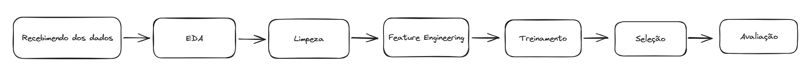
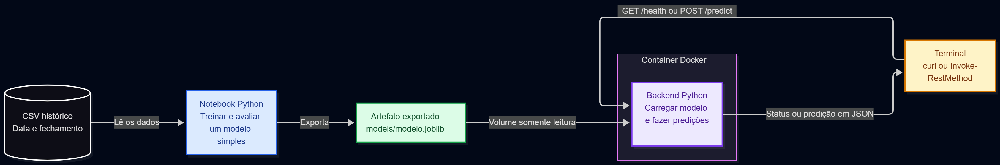
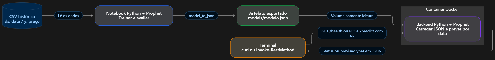
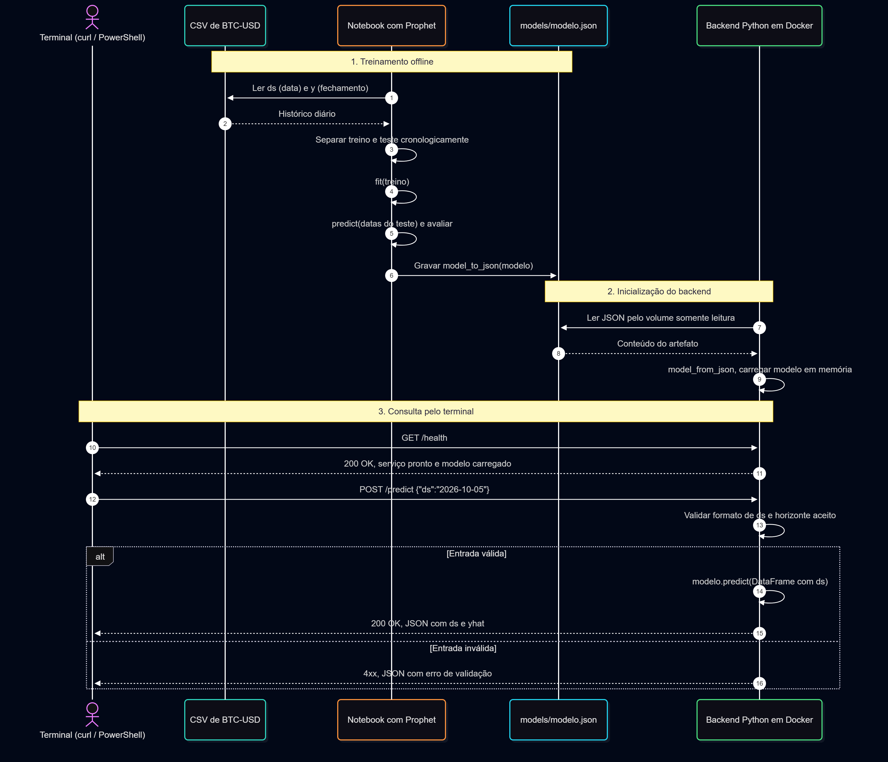
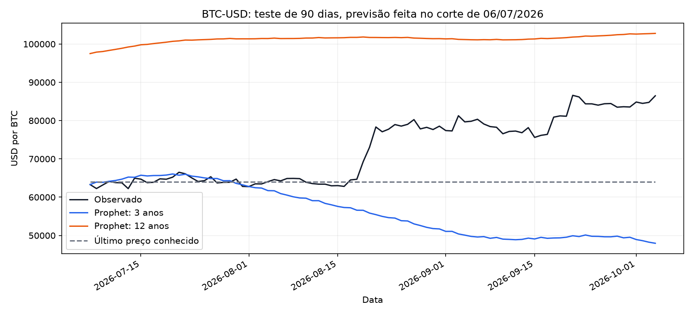
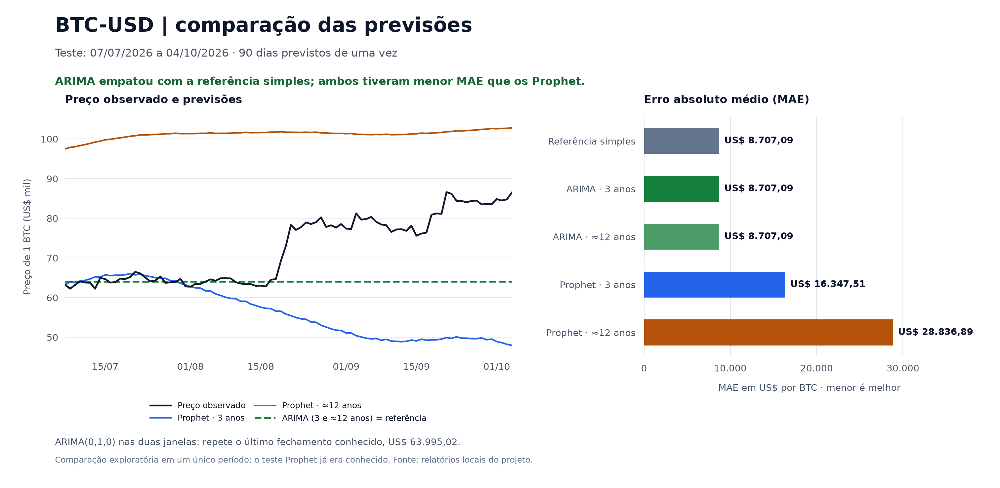
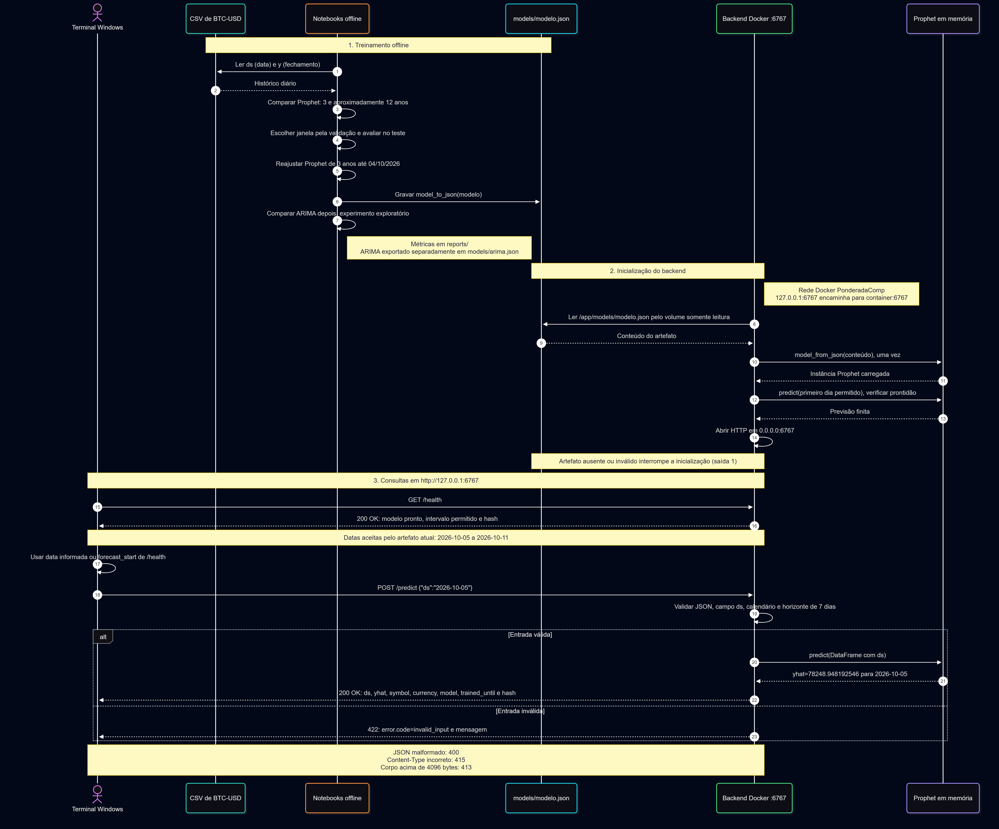
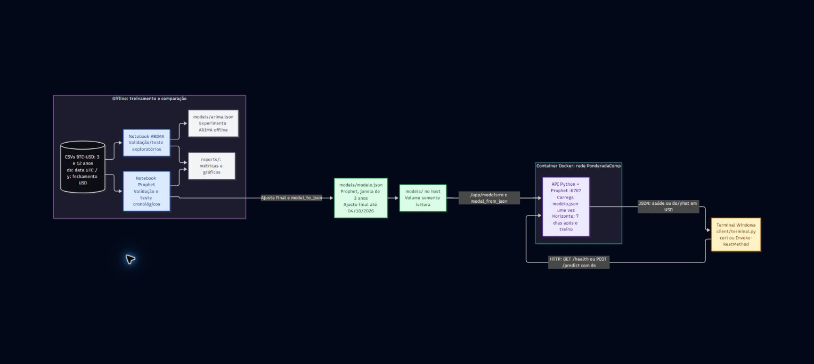

# Ponderada M7: previsão de BTC-USD

Solução simples: dados CSV → treinamento Prophet → modelo JSON → API em Docker → cliente no terminal.

## Executar do zero

Pré-requisitos: Git, Docker com Compose e acesso ao repositório. A primeira construção da imagem usa internet para baixar a base Python e as dependências. Treinamento, API e cliente executam em containers, usando os dados incluídos no repo.

### 1. Clonar e entrar na pasta

Enquanto a entrega está em revisão, use a branch abaixo, que contém os arquivos de execução:

```sh
git clone --branch docs/arquitetura-inicial https://github.com/C-Icaro/ponderada-m7-predicao-moeda.git
cd ponderada-m7-predicao-moeda
```

Execute os próximos comandos na raiz dessa pasta, em um terminal com `docker` disponível.

No Windows deste projeto, o Docker está no WSL `Ubuntu-24.04`. Para abrir esse terminal na pasta do repo, execute no PowerShell:

```powershell
wsl -d Ubuntu-24.04 --cd "$PWD"
```

Siga os comandos Docker dentro do WSL e mantenha a sessão aberta enquanto a API estiver rodando. Com Docker Desktop disponível diretamente no PowerShell, essa etapa é dispensável.

### 2. Construir a imagem e treinar

```sh
docker compose build
docker run --rm --user 0:0 --mount "type=bind,source=${PWD},target=/workspace" --workdir /workspace ponderadacomp-backend:local python training/train_compare.py
```

O primeiro comando usa o [Dockerfile](Dockerfile) e instala as versões de [requirements-backend.txt](requirements-backend.txt), iguais às do treinamento Prophet. O segundo executa [training/train_compare.py](training/train_compare.py) em um container temporário: compara três e 12 anos, gera os relatórios em `reports/` e salva **`models/modelo.json`**, que a API precisa carregar.

A pasta do repo é montada no container, por isso os arquivos gerados permanecem no computador após ele terminar. `--user 0:0` permite gravar nessa pasta; a API executa como o usuário `app` definido no Dockerfile. Em Linux, os arquivos gerados pelo treinamento podem ficar com proprietário root. Os modelos gerados continuam fora do Git.

### 3. Iniciar a API

```sh
docker compose up --no-build
```

Mantenha esse terminal aberto. O [compose.yaml](compose.yaml) inicia o backend, monta `models/` somente para leitura e disponibiliza a API em **http://127.0.0.1:6767**, na rede Docker **`PonderadaComp`**. O modelo é carregado ao iniciar o serviço; depois de treinar novamente, reinicie a API.

### 4. Fazer uma previsão

Abra outro terminal com Docker disponível, entre na mesma pasta do repo e execute:

```sh
docker compose ps
docker run --rm --network PonderadaComp --mount "type=bind,source=${PWD},target=/workspace,readonly" --workdir /workspace ponderadacomp-backend:local python client/terminal.py --url http://backend:6767
```

Espere o backend aparecer como `healthy` no primeiro comando. O segundo executa [client/terminal.py](client/terminal.py), consulta `GET /health` e faz `POST /predict` para o primeiro dia aceito. O resultado esperado é HTTP `200` e um JSON com `ds` (data) e `yhat` (previsão em USD por BTC). Dentro da rede Docker, o endereço do serviço é `http://backend:6767`.

Para escolher uma data, acrescente-a ao final do comando do cliente, por exemplo `2026-10-05`. Com os dados incluídos, a API aceita **2026-10-05 a 2026-10-11**, os sete dias após o fim do treino. Datas fora desse intervalo retornam HTTP `422`.

Se já tiver Python instalado, também pode consultar a API pelo terminal do computador:

```sh
python client/terminal.py
```

### 5. Encerrar

Use `Ctrl+C` no terminal da API e depois execute, na raiz do repo:

```sh
docker compose down
```

Esse comando remove os containers e a rede do projeto. Os CSVs e modelos permanecem na pasta do repo; a imagem Docker pode ser reutilizada.

## Dados incluídos no repo

Os CSVs contêm **preços públicos de mercado de BTC-USD obtidos do [Yahoo Finance](https://finance.yahoo.com/quote/BTC-USD/history/)** e estão versionados para reproduzir o experimento sem uma nova coleta. Não contêm dados pessoais.

| Arquivo | Período | Linhas | Tamanho |
| --- | --- | ---: | ---: |
| [data/processed/btc_usd_daily.csv](data/processed/btc_usd_daily.csv) | 2023-10-05 a 2026-10-04 | 1.096 | 26,3 KiB |
| [data/processed/btc_usd_daily_12y.csv](data/processed/btc_usd_daily_12y.csv) | 2014-09-17 a 2026-10-04 | 4.401 | 113,6 KiB |

As colunas são `ds` (data diária) e `y` (fechamento em USD por BTC). A [procedência](data/README.md) registra a fonte, os períodos e os hashes SHA-256. Preserve os arquivos e os metadados juntos: o treinamento confere os hashes antes de ajustar os modelos.

Para repetir a coleta, opcionalmente, use a mesma imagem Docker. Estes comandos sobrescrevem os respectivos CSVs e metadados; dependem da internet e o Yahoo pode revisar preços históricos:

```sh
docker run --rm --user 0:0 --mount "type=bind,source=${PWD},target=/workspace" --workdir /workspace ponderadacomp-backend:local python data/download_btc.py
docker run --rm --user 0:0 --mount "type=bind,source=${PWD},target=/workspace" --workdir /workspace ponderadacomp-backend:local python data/download_btc.py --start 2014-09-17 --end 2026-10-05 --output data/processed/btc_usd_daily_12y.csv --metadata data/coleta-btc-usd-12y.json
```

## ARIMA opcional

O backend usa Prophet. Para reproduzir a comparação exploratória ARIMA, execute depois do treinamento Prophet, em um ambiente Python 3.13 local, versão usada nesse experimento:

```powershell
python -m venv .venv
.venv\Scripts\python.exe -m pip install --no-cache-dir --only-binary=:all: -r requirements-arima.txt
.venv\Scripts\python.exe training/train_arima.py
```

Esse script usa também os relatórios e CSVs de previsões gerados pelo Prophet. Gera `models/arima.json` separado; ele não substitui o modelo carregado pela API. Veja [training/README.md](training/README.md) para versões e testes.

## Resultados e documentação

Os relatórios versionados registram a execução original no Windows com Python 3.13. O roteiro Docker usa Linux com Python 3.12 e gera seus próprios relatórios em `reports/`; os valores e hashes dos modelos podem diferir entre ambientes, mesmo com os mesmos CSVs.

Na verificação deste roteiro em 05/10/2026, o clone limpo construiu a imagem, treinou Prophet, passou nos cinco testes de treinamento e retornou HTTP `200` pelo cliente. Os hashes dos CSVs foram preservados. O MAE do teste de 90 dias foi USD 16.867,51 (três anos) e USD 29.041,29 (12 anos); repetir o último fechamento teve menor erro, USD 8.707,09. Essa comparação não comprova precisão no horizonte de sete dias da API.

- [Resultados Prophet](reports/comparacao.md) e [ARIMA](reports/arima.md).
- [Contrato da API e evidência Docker](backend/README.md), [cliente](client/README.md) e [integração registrada](reports/integracao.json).
- [Arquitetura](docs/arquitetura.md), [requisitos](docs/requisitos.md) e [devlog](DEVLOG.md).
- [Enunciado da atividade](https://github.com/Murilo-ZC/Atividade-Ponderada-M7-2026-EC).

## Devlog integral de 05/10/2026

Fonte: [Devlog Ponderada Comp 05/10](https://chatgpt.com/space/page_2bfec55efbac8191ba19288466eeb01e). Registro original do autor, com texto preservado e imagens copiadas da Page.


14:17 - Começo da ponderada: Leitura do material

14:23 - Dúvidas levantadas: Qual moeda escolher? Minha suposição é que bitcoin precisaria de um volume de dados muito grande, que meu ssd com 10gb livres não iriam suportar. Mas também suponho que para prever dollar preciariamos correlacionar muitas variáveis da politica internacional

14:25 - Esboço do diagrama UML

14:32 - Revisão do esboço com IA: GPT 6.1 Sol Ultra em Fast Mode

Figura 01: V0 (esboço) da arquitetura/fluxo feito no excalidraw



14:40 - Os pontos levantados foram justamente a falta de detalhamento entre as etapas, que o recebimento de dados seria feito por csv, se fariamos scripts ou notebooks, o que vai e o que não vai estar no container e etc. Solicitei uma versão revisada no mermaid e o resultado foi:\

Figura 02: V1 da arquitetura, revisada e iterada com IA&#x20;



14:47 - Instruí meu agente para utilizar a ferramente Prophet [Quick Start | Prophet](https://facebook.github.io/prophet/docs/quick_start.html) para produção de modelos

Figura 03: V1.1 da arquitetura, revisada e iterada com IA&#x20;



14:49 - Utilizei o agente para tirar a dúvida sobre qual moeda escolher com base nos dados disponíveis no yahoo finance

15:03 - Acabou que com fechamentos diários o dataset de BTC previsto em USD pesou apenas 26,3Kb com 3 anos de dados (1.096 registros de 05/10/2023 a 04/10/2026). Então optei por utilizar o histórico completo no dataset, de 17/09/2014 a 04/10/2026. Dataset Utilizado: [https://finance.yahoo.com/quote/BTC-USD/history/](https://finance.yahoo.com/quote/BTC-USD/history/) . Mais dados não significam um modelo melhor, o passado pode ter (e tem) um comportamento diferente do mercado atual, mas isso só veremos nos testes, o aumento de histórico deve ser avaliado.

Prévia do dataset df.head():\

| Data | Valor |
| - | -: |
| 2023-10-05 | 27.415,91 |
| 2023-10-06 | 27.946,60 |
| 2023-10-07 | 27.968,84 |
| 2023-10-08 | 27.935,09 |
| 2023-10-09 | 27.583,68 |


15:09 - Senti falta de um diagrama de sequencia, então utilizei o que já temos como base para desenvolver um diagrama de sequencia

Figura 04: V1 do diagrama de sequencia da solução



Achei condizente com o que precisamos entregar, está horizontalmente grande, mas representa bem e com simplicidade todos os pontos solicitados na ponderada

15:13: A estrutura atual do repositório é

```text
Ponderada Comp/
├── README.md
├── DEVLOG.md
├── .gitignore
├── .gitattributes
├── backend/
│   └── README.md
├── client/
│   └── README.md
├── data/
│   ├── README.md
│   ├── download_btc.py
│   ├── coleta-btc-usd.json
│   └── processed/
│       └── btc_usd_daily.csv
├── docs/
│   ├── requisitos.md
│   ├── arquitetura.md
│   ├── arquitetura.mmd
│   ├── arquitetura.puml
│   ├── pipeline.mmd
│   ├── sequencia.mmd
│   └── imagens/
│       ├── esboco-pipeline-original.png
│       ├── arquitetura-mermaid.svg
│       ├── arquitetura-mermaid-editor.jpg
│       ├── pipeline-mermaid.svg
│       ├── pipeline-mermaid-editor.jpg
│       ├── sequencia-mermaid.svg
│       └── sequencia-mermaid-editor.jpg
├── models/
│   └── README.md
└── training/
    └── README.md
```

Ainda sem dockerfile e compone.yaml. Já temos muitos arquivos e pastas, meu ambiente de desenvolvimento acaba sendo muito verboso, tenho instruções para documentações completas, por isso pipeline, arquitetura, requisitos e readme’s localizados.

15:16 - Utilizando inicialmente MAE (Mean Absolute Error) como métrica, solicitei a produção de dois modelos, o primeiro com 3 anos de dados e um segundo com toda a série disponível no dataset, 12 anos.

15:20 - Enquanto os modelos estavam sendo treinados, avaliei outro agente para paralelizar a dockerização, mas não achei que valia a pena dividir contexto ainda

15:26 - Os primeiros resultados saíram, o modelo com 3 anos de dados produziu um erro muito menor no começo, mas no fim ambos terminaram péssimos.

Figura 05: V1 Gráfico comparativo dos modelos



15:29 - Pretendo testar também o modelo Arima, mas como preciso focar nos entregáveis, deixarei um agente cuidando disso e outro focando no que realmente importa para a entrega: O backend no container, o dockerfile e arquivo compose

15:31 - Fiquei com dúvida se um modelo Arima geraria ou não um joblib, já que foi previsto na arquitetura. Não necessariamente gera, mas pode ser feito, imagino que assim como qualquer outro modelo:

```python
from statsmodels.tsa.arima.model import ARIMA
import joblib

# Treinamento do modelo
modelo = ARIMA(serie_precos, order=(1, 1, 1)).fit()

# Salvamento
joblib.dump(modelo, "modelo_arima.joblib")

# Carregamento no backend
modelo = joblib.load("modelo_arima.joblib")

# Previsão para os próximos 7 períodos
previsoes = modelo.forecast(steps=7)
```

15:34 - Atualizei o agente com o meu devlog e o intruí para cordenar o desenvolvimento do backend e do container em outro agente enquanto ele desenvolve o Modelo Arima. A rede será PonderadaComp e a porta liberada será 6767

15:42 - Sairam os resultados de validação do Arima, foram melhores do que baseline com MAE, mas esperava mais.

15:48 - Os endpoints da api foram testados e retornaram 200, evidenciando o funcionamento do conteiner e da rede. Também atualizei o gráfico comparativo entre os modelos:

Códigos para testes dos endpoints:\

GET /health: verificar disponibilidade e modelo carregado

```powershell
Invoke-RestMethod -Method Get `
  -Uri 'http://127.0.0.1:6767/health' |
  ConvertTo-Json -Depth 4
```

POST /predict: prever o fechamento do BTC em USD

```powershell
Invoke-RestMethod -Method Post `
  -Uri 'http://127.0.0.1:6767/predict' `
  -ContentType 'application/json' `
  -Body '{"ds":"2026-10-05"}' |
  ConvertTo-Json -Depth 4
```

Figura 05: V1 Gráfico comparativo dos modelos



15:58 - Predições dos modelos:\
\
O ARIMA escolhido, (0,1,0) sem tendência, prevê que o preço continuará igual ao último fechamento conhecido. Ele venceu porque teve menor erro médio que os Prophet.

Para teste, o ultimo valor conhecido era US$ 63.995,02, em 06/07/2026:

| <p>Data</p> | <p>Preço observado (US$)</p> | <p>Prophet 3 anos</p> | <p>Prophet ≈12 anos</p> | <p>ARIMA, ambas as janelas</p> |
| - | - | - | - | - |
| 07/07/2026 | 63.297,39 | 63.303,01 | 97.504,18 | 63.995,02 |
| 01/08/2026 | 62.763,32 | 62.788,55 | 101.356,01 | 63.995,02 |
| 04/10/2026 | 86.480,30 | 47.964,71 | 102.778,67 | 63.995,02 |

Depois do reajuste com dados até 04/10/2026, o último fechamento passou a ser US$ 86.480,30. Estas são as previsões dos dois modelos finais, ambos com três anos:

| <p>Data</p> | <p>Prophet (US$)</p> | <p>ARIMA (US$)</p> | <p>Preço real observado (US$)</p> |
| - | - | - | - |
| 05/10/2026 | 78.248,95 | 86.480,30 | 85.657,98\* |
| 06/10/2026 | 77.738,06 | 86.480,30 | Ainda indisponível |
| 07/10/2026 | 77.794,01 | 86.480,30 | Ainda indisponível |
| 08/10/2026 | 77.229,99 | 86.480,30 | Ainda indisponível |
| 09/10/2026 | 76.924,05 | 86.480,30 | Ainda indisponível |
| 10/10/2026 | 76.544,47 | 86.480,30 | Ainda indisponível |
| 11/10/2026 | 76.302,84 | 86.480,30 | Ainda indisponível |

A coluna constante mostra justamente o empate do ARIMA com a referência simples. A precisão dessas novas previsões ainda não foi avaliada.


16:05 - Arquitetura e Diagrama e sequencia atualizados para considerar modelo Arima (parte offline), Prophet, nome da rede e portas:\

Figura 06: V2 do diagrama de sequencia da solução



Figura 07: V2 da arquitetura, revisada e iterada com IA&#x20;



16:10 - Pausa pro Café

16:20 - Estrutura de arquivos e pastas atualizada:

```text
Ponderada Comp/
├── README.md
├── DEVLOG.md
├── Dockerfile
├── compose.yaml
├── .dockerignore
├── .gitattributes
├── .gitignore
├── requirements-training.txt
├── requirements-arima.txt
├── requirements-backend.txt
├── backend/
│   ├── README.md
│   ├── app.py
│   └── test_app.py
├── client/
│   ├── README.md
│   └── terminal.py
├── data/
│   ├── README.md
│   ├── download_btc.py
│   ├── coleta-btc-usd.json
│   ├── coleta-btc-usd-12y.json
│   └── processed/
│       ├── btc_usd_daily.csv
│       └── btc_usd_daily_12y.csv
├── docs/
│   ├── requisitos.md
│   ├── arquitetura.md
│   ├── arquitetura.mmd
│   ├── arquitetura.puml
│   ├── pipeline.mmd
│   ├── sequencia.mmd
│   └── imagens/
│       ├── esboco-pipeline-original.png
│       ├── arquitetura-mermaid.svg
│       ├── arquitetura-mermaid-editor.jpg
│       ├── arquitetura-v1.svg
│       ├── arquitetura-v1-1.svg
│       ├── arquitetura-v2.svg
│       ├── arquitetura-v2-editor.jpg
│       ├── pipeline-mermaid.svg
│       ├── pipeline-mermaid-editor.jpg
│       ├── sequencia-mermaid.svg
│       ├── sequencia-mermaid-editor.jpg
│       ├── sequencia-v2.svg
│       └── sequencia-v2-editor.jpg
├── models/
│   ├── README.md
│   ├── modelo.json
│   ├── modelo-3y.json
│   ├── modelo-12y.json
│   ├── arima.json
│   ├── arima-3y.json
│   └── arima-12y.json
├── reports/
│   ├── comparacao.md
│   ├── comparacao.json
│   ├── comparacao-teste.png
│   ├── comparacao-teste.svg
│   ├── selecao-validacao.json
│   ├── predicoes-validacao.csv
│   ├── predicoes-teste.csv
│   ├── arima.md
│   ├── arima.json
│   ├── arima-teste.png
│   ├── selecao-arima.json
│   ├── predicoes-arima-teste.csv
│   └── integracao.json
└── training/
    ├── README.md
    ├── comparacao.ipynb
    ├── arima.ipynb
    ├── protocolo.md
    ├── protocolo-arima.md
    ├── train_compare.py
    ├── train_arima.py
    ├── test_train_compare.py
    └── test_train_arima.py
```

16:25 - Readme atualizado com as intruções de reprodução. Os csv de dados foram incluidos no repo por serem dados públicos e facilitarem a reprodução.

16:32 - Repositório revisado e devlog integrado no readme (na integra)


\

<!-- Fim do devlog integral -->
