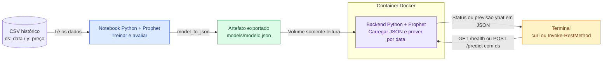

# Arquitetura simples

A interface de uso será o **terminal**. A proposta tem um CSV pequeno, um notebook com Prophet, um modelo exportado em JSON e um backend Python em um único container Docker.

O [esboço original](imagens/esboco-pipeline-original.png) permanece preservado. Esta versão em Mermaid acrescenta os componentes necessários à demonstração. Tudo abaixo é uma proposta; os componentes ainda não foram implementados.

## Arquitetura em Mermaid

Fonte editável: [arquitetura.mmd](arquitetura.mmd).

[Exportação SVG](imagens/arquitetura-mermaid.svg) · [Captura do navegador](imagens/arquitetura-mermaid-editor.jpg).

## Treinamento

Fonte editável: [pipeline.mmd](pipeline.mmd).

[Exportação SVG](imagens/pipeline-mermaid.svg) · [Captura do navegador](imagens/pipeline-mermaid-editor.jpg).

```mermaid
flowchart LR
    Dados["Receber o CSV"] --> Preparacao["Explorar e limpar<br/>Ordenar por data"]
    Preparacao --> Colunas["Preparar ds e y<br/>Data e preço numérico"]
    Colunas --> Divisao["Separar treino e teste<br/>Em ordem cronológica"]
    Divisao --> Treino["Ajustar Prophet<br/>fit no treino"]
    Treino --> Avaliacao["Prever nas datas do teste<br/>Comparar yhat com y"]
    Avaliacao --> Exportacao["Exportar modelo.json<br/>model_to_json"]

    classDef processo fill:#dbeafe,stroke:#2563eb,color:#1e3a8a
    classDef cuidado fill:#fef3c7,stroke:#d97706,color:#78350f
    classDef saida fill:#dcfce7,stroke:#16a34a,color:#14532d
    class Dados,Preparacao,Colunas,Treino processo
    class Divisao,Avaliacao cuidado
    class Exportacao saida
```

O notebook prepara `ds` (data) e `y` (preço), separa treino e teste em ordem cronológica e ajusta Prophet no treino. Para avaliar, prevê apenas nas datas do teste e compara `yhat` com o preço observado. O caso básico usará somente data e preço.

## Como o modelo chega ao backend

O notebook grava `models/modelo.json` com `prophet.serialize.model_to_json`. A pasta `models/` será montada no container com acesso somente leitura. O backend carrega esse arquivo ao iniciar com `model_from_json`, seguindo a [serialização oficial](https://facebook.github.io/prophet/docs/additional_topics.html#saving-models).

O terminal fará as chamadas HTTP, usando `curl` ou `Invoke-RestMethod` no PowerShell:

| Operação proposta | O que demonstra |
| --- | --- |
| `GET /health` | Serviço disponível e modelo carregado |
| `POST /predict` | Entrada enviada ao backend e predição recebida em JSON |

O contrato proposto para `POST /predict` é receber a data `ds` e retornar `ds` e `yhat` em JSON. Validar o formato da data e o horizonte aceito. Os comandos reproduzíveis e as respostas reais serão registrados no devlog durante a implementação.

## Aceite e decisões pendentes

O aceite da implementação será: notebook executado, modelo exportado e carregado no container, verificação do serviço e uma predição solicitada pelo terminal. Registrar os comandos, a resposta e limitações no devlog. Verificar também o comportamento de entrada inválida e modelo ausente.

Prophet foi adotado na proposta após a recomendação do professor relatada pelo autor. Moeda/par, fonte, período, frequência e horizonte de previsão permanecem abertos. A divisão inicial usa apenas treino e teste. Comparar vários modelos é uma extensão opcional.

Referência técnica: [Quick Start do Prophet](https://facebook.github.io/prophet/docs/quick_start.html).

Referências: [enunciado](https://github.com/Murilo-ZC/Atividade-Ponderada-M7-2026-EC), [requisitos](requisitos.md) e [UML complementar em PlantUML](arquitetura.puml). O Mermaid é uma visão de fluxo entre componentes; a fonte PlantUML mantém a notação UML solicitada no enunciado.
