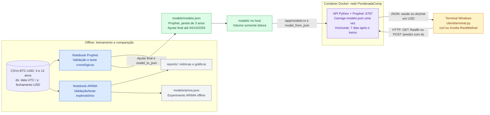
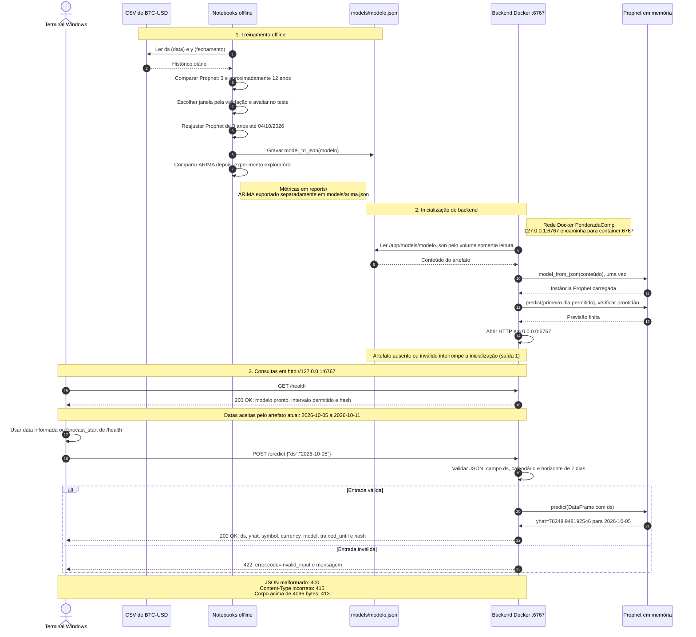

# Arquitetura simples

A interface de uso é o **terminal**. A solução usa dois CSVs diários, notebooks offline para comparar Prophet e ARIMA, um modelo Prophet exportado em JSON e um backend Python em um único container Docker. A porta é `6767` e a rede Docker tem nome `PonderadaComp`.

O [esboço original](imagens/esboco-pipeline-original.png) permanece preservado. A arquitetura V2 distingue o treinamento e a avaliação offline da inferência no container. Os [CSVs diários de BTC-USD](../data/README.md) foram coletados, o [notebook de comparação](../training/comparacao.ipynb) foi executado e os modelos JSON foram exportados. O [backend](../backend/README.md) carrega Prophet uma vez; o [cliente terminal](../client/README.md) consulta saúde e previsão por HTTP.

## Arquitetura em Mermaid

Fonte editável: [arquitetura.mmd](arquitetura.mmd).

[Exportação SVG V2](imagens/arquitetura-v2.svg) · [Captura do navegador](imagens/arquitetura-v2-editor.jpg).

## Treinamento

Fonte editável: [pipeline.mmd](pipeline.mmd).

[Exportação SVG](imagens/pipeline-mermaid.svg) · [Captura do navegador](imagens/pipeline-mermaid-editor.jpg).

```mermaid
flowchart LR
    Dados["Receber o CSV"] --> Preparacao["Explorar e limpar<br/>Ordenar por data"]
    Preparacao --> Colunas["Preparar ds e y<br/>Data e preço numérico"]
    Colunas --> Divisao["Separar treino e teste<br/>Em ordem cronológica"]
    Divisao --> Treino["Ajustar Prophet<br/>fit no treino"]
    Treino --> Avaliacao["Prever nas datas do teste<br/>Comparar yhat com y"]
    Avaliacao --> Exportacao["Exportar modelo.json<br/>model_to_json"]

    classDef processo fill:#dbeafe,stroke:#2563eb,color:#1e3a8a
    classDef cuidado fill:#fef3c7,stroke:#d97706,color:#78350f
    classDef saida fill:#dcfce7,stroke:#16a34a,color:#14532d
    class Dados,Preparacao,Colunas,Treino processo
    class Divisao,Avaliacao cuidado
    class Exportacao saida
```

O notebook prepara `ds` (data) e `y` (preço), separa treino e teste em ordem cronológica e ajusta Prophet no treino. Para avaliar, prevê apenas nas datas do teste e compara `yhat` com o preço observado. O caso básico usará somente data e preço.

A [comparação executada](../reports/comparacao.md) acrescenta uma validação cronológica anterior ao teste final para escolher entre as janelas de três e 12 anos. O [protocolo](../training/protocolo.md) registra cortes, parâmetros e critério de escolha. O pipeline acima é a visão resumida; os mesmos componentes atendem às duas janelas.

## Como o modelo chega ao backend

O notebook grava `models/modelo.json` com `prophet.serialize.model_to_json`. A pasta `models/` é montada no container com acesso somente leitura. O backend carrega esse arquivo ao iniciar com `model_from_json`, seguindo a [serialização oficial](https://facebook.github.io/prophet/docs/additional_topics.html#saving-models). Antes de abrir a porta, confere uma previsão do artefato carregado.

O terminal faz as chamadas HTTP usando `python client/terminal.py`, `curl` ou `Invoke-RestMethod` no PowerShell:

| Operação | O que demonstra |
| --- | --- |
| `GET /health` | Serviço disponível e modelo carregado |
| `POST /predict` | Entrada enviada ao backend e predição recebida em JSON |

`POST /predict` recebe somente `{"ds":"YYYY-MM-DD"}` e retorna `ds` e `yhat`, acompanhados de moeda, modelo, data final do treino e hash. Aceita os sete dias seguintes ao fim do treino. Com o artefato atual, de 05/10/2026 a 11/10/2026. Entradas inválidas retornam erro HTTP/JSON; o cliente pode usar `forecast_start` informado em `/health` para escolher automaticamente a primeira data.

## Sequência em Mermaid

Fonte editável: [sequencia.mmd](sequencia.mmd).

[Exportação SVG V2](imagens/sequencia-v2.svg) · [Captura do navegador](imagens/sequencia-v2-editor.jpg). A fonte Mermaid abaixo reflete o contrato e as respostas verificados no container.

O diagrama mostra a ordem das interações na solução. O notebook Prophet compara as janelas, avalia os modelos e reajusta a janela selecionada até 04/10/2026 antes da exportação. O experimento ARIMA posterior registra métricas e artefato separados, enquanto o backend continua carregando Prophet. O backend carrega uma instância Prophet em memória e verifica uma previsão antes de abrir a porta. O terminal no Windows consulta `127.0.0.1:6767`; o container participa da rede `PonderadaComp` e lê o JSON pelo volume somente leitura. A [evidência de integração](../reports/integracao.json) registra HTTP 200 e `yhat=78248.948192546` para 05/10/2026.

Este fluxo representa o caminho com artefato válido. Arquivo ausente ou inválido interrompe a inicialização; `GET /health` só indica prontidão após o carregamento e uma previsão inicial válida. O horizonte de uso é sete dias. As previsões de 90 dias usadas na avaliação são um experimento separado desse limite operacional.

## Aceite e experimento adicional

O aceite exige notebook executado, modelo exportado e carregado no container, verificação do serviço e uma predição solicitada pelo terminal. Os comandos, respostas e limites ficam no [devlog](../DEVLOG.md) e no [backend](../backend/README.md), incluindo entradas inválidas e artefato ausente.

Prophet foi adotado após a recomendação do professor relatada pelo autor. Três anos foram escolhidos pelo menor MAE da validação. O [ARIMA exploratório](../reports/arima.md) solicitado depois do teste gerou artefatos separados e não alterou essa escolha. ARIMA(0,1,0) venceu sua validação, mas equivale à referência do último fechamento. Configurações e métricas estão nos protocolos e relatórios.

Referência técnica: [Quick Start do Prophet](https://facebook.github.io/prophet/docs/quick_start.html).

Referências: [enunciado](https://github.com/Murilo-ZC/Atividade-Ponderada-M7-2026-EC), [requisitos](requisitos.md) e [UML complementar em PlantUML](arquitetura.puml). O Mermaid reúne arquitetura, pipeline e sequência de mensagens; a fonte PlantUML mantém a visão UML de componentes solicitada no enunciado.
