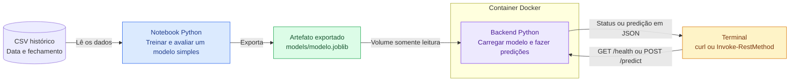

# Arquitetura simples

A interface de uso será o **terminal**. A proposta tem um CSV pequeno, um notebook de treinamento, um modelo exportado e um backend Python em um único container Docker.

O [esboço original](imagens/esboco-pipeline-original.png) permanece preservado. Esta versão em Mermaid acrescenta os componentes necessários à demonstração. Tudo abaixo é uma proposta; os componentes ainda não foram implementados.

## Arquitetura em Mermaid

Fonte editável: [arquitetura.mmd](arquitetura.mmd).

[Exportação SVG](imagens/arquitetura-mermaid.svg) · [Captura do navegador](imagens/arquitetura-mermaid-editor.jpg).

## Treinamento

Fonte editável: [pipeline.mmd](pipeline.mmd).

[Exportação SVG](imagens/pipeline-mermaid.svg) · [Captura do navegador](imagens/pipeline-mermaid-editor.jpg).

```mermaid
flowchart LR
    Dados["Receber o CSV"] --> Preparacao["Explorar e limpar<br/>Ordenar por data"]
    Preparacao --> Features["Definir entradas<br/>Sem usar dados futuros"]
    Features --> Divisao["Separar treino e teste<br/>Em ordem cronológica"]
    Divisao --> Treino["Treinar um modelo simples"]
    Treino --> Avaliacao["Avaliar no teste reservado"]
    Avaliacao --> Exportacao["Exportar modelo.joblib<br/>Com transformações, se usadas"]

    classDef processo fill:#dbeafe,stroke:#2563eb,color:#1e3a8a
    classDef cuidado fill:#fef3c7,stroke:#d97706,color:#78350f
    classDef saida fill:#dcfce7,stroke:#16a34a,color:#14532d
    class Dados,Preparacao,Features,Treino processo
    class Divisao,Avaliacao cuidado
    class Exportacao saida
```

O notebook lê o CSV, separa treino e teste em ordem cronológica, treina um modelo e registra a avaliação. Se houver transformações com parâmetros aprendidos, elas serão ajustadas no treino e exportadas junto do modelo. As entradas só podem usar informações disponíveis no momento da previsão.

## Como o modelo chega ao backend

O notebook grava `models/modelo.joblib`. A pasta `models/` será montada no container com acesso somente leitura. O backend carrega esse arquivo ao iniciar. O formato Joblib é a proposta inicial e depende da biblioteca de modelagem escolhida.

O terminal fará as chamadas HTTP, usando `curl` ou `Invoke-RestMethod` no PowerShell:

| Operação proposta | O que demonstra |
| --- | --- |
| `GET /health` | Serviço disponível e modelo carregado |
| `POST /predict` | Entrada enviada ao backend e predição recebida em JSON |

O corpo da requisição será definido após escolher as entradas do modelo. Os comandos reproduzíveis e as respostas reais serão registrados no devlog durante a implementação.

## Aceite e decisões pendentes

O aceite da implementação será: notebook executado, modelo exportado e carregado no container, verificação do serviço e uma predição solicitada pelo terminal. Registrar os comandos, a resposta e limitações no devlog. Verificar também o comportamento de entrada inválida e modelo ausente.

Moeda/par, fonte, período, frequência, horizonte de previsão e biblioteca de modelagem permanecem abertos. A divisão inicial usa apenas treino e teste. Comparar vários modelos é uma extensão opcional.

Referências: [enunciado](https://github.com/Murilo-ZC/Atividade-Ponderada-M7-2026-EC), [requisitos](requisitos.md) e [UML complementar em PlantUML](arquitetura.puml). O Mermaid é uma visão de fluxo entre componentes; a fonte PlantUML mantém a notação UML solicitada no enunciado.
