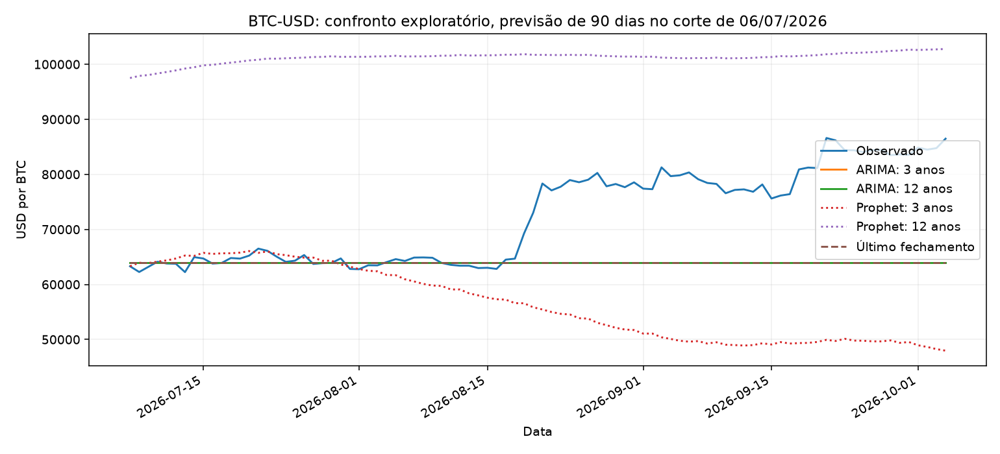

# ARIMA versus Prophet: comparação exploratória

O teste Prophet já havia sido observado. Ordens e desempates ARIMA foram fixados antes dos ajustes; o resultado não constitui um novo teste intocado.

## Validação: escolha da ordem

| Histórico | Ordem | Convergiu | MAE (USD) |
| --- | --- | --- | ---: |
| 3y | (0, 1, 0) | True | 6613.45 |
| 3y | (1, 1, 0) | True | 6635.62 |
| 3y | (0, 1, 1) | True | 6637.02 |
| 3y | (1, 1, 1) | True | 6634.46 |
| 12y | (0, 1, 0) | True | 6613.45 |
| 12y | (1, 1, 0) | True | 6631.22 |
| 12y | (0, 1, 1) | True | 6631.94 |
| 12y | (1, 1, 1) | True | 6629.73 |

Janela escolhida pela validação: **3y**. As ordens escolhidas e os avisos estão no JSON completo.

## Teste de 07/07/2026 a 04/10/2026

| Modelo | MAE (USD) | RMSE (USD) | sMAPE (%) |
| --- | ---: | ---: | ---: |
| ARIMA 3y (0, 1, 0) | 8707.09 | 11875.25 | 12.09 |
| ARIMA 12y (0, 1, 0) | 8707.09 | 11875.25 | 12.09 |
| Prophet 3y | 16347.51 | 21582.53 | 25.06 |
| Prophet 12y | 28836.89 | 29900.36 | 33.77 |
| Último fechamento | 8707.09 | 11875.25 | 12.09 |

Cada modelo prevê os mesmos 90 dias de uma vez, sem incorporar preços do bloco. ARIMA(0,1,0) sem drift equivale à referência do último fechamento. Um resultado melhor neste recorte não comprova generalização ou ganho financeiro.

O ajuste final ARIMA está em `models/arima.json`, separado de `models/modelo.json` (Prophet, usado pelo backend). O ajuste final não foi avaliado em dados posteriores. JSONs foram reconstruídos e suas previsões conferidas; arquivos gerados ficam fora do Git.

[Protocolo](../training/protocolo-arima.md), [notebook](../training/arima.ipynb), [resultados e hashes](arima.json) e [seleção registrada](selecao-arima.json).
